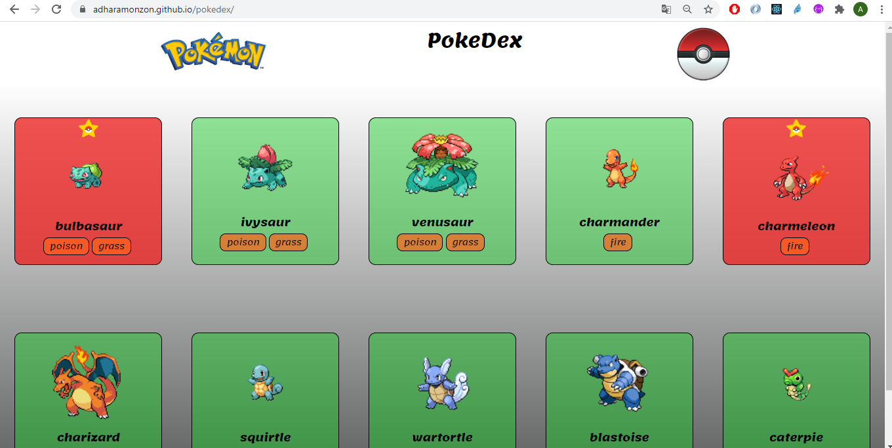

# POKEDESK

# Este es el resultado!💥

https://adharamonzon.github.io/pokedex/

## Objetivo 🎯

Este ejercicio es de la evaluación intermedia del módulo de React, en él, el **objetivo** es crear una PokeDesk en la que salgan un número delimitado de pokemons y sus evoluciones y puedas elegir tus favoritos.

## Tecnologías utilizadas 💻

### HTML ✔

Para la estructura de la página web se ha utlizado HTML5, código más ordenado y legible, también se han utilizado etiquetas semánticas para mejorar la accesibilidad.

### CSS3 ✔

Para los estilos de la página web se ha utilizado CSS.

### JavaScript / React ✔

Para la funcionalidad de la página se ha utilizado React.js para pintar con JSX y escuchar el evento de favoritos.

## Instalación del proyecto 🚀

Puedes clonarte el repositorio a través de este enlace, poniendo en la consola: **git clonehttps://github.com/adharamonzon/pokedex.git** y abrir el servidor **npm start**.
